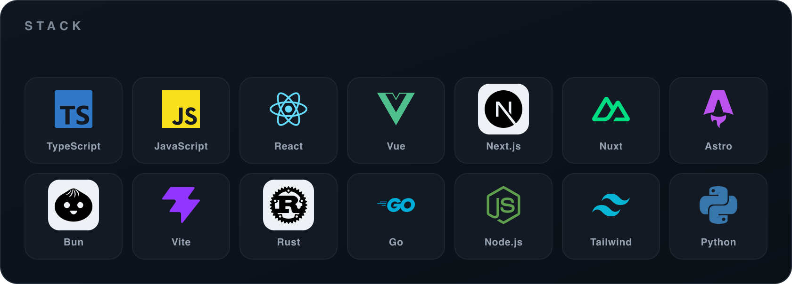

<div align="center">

<h1>椎名 朔</h1>
<p><samp>Saku Shiina &nbsp;·&nbsp; frontend / systems / TypeScript / Rust / Go</samp></p>


<br />

<a href="https://shiina.xyz"></a>
<a href="https://shiina.xyz/blog"></a>
<a href="https://x.com/saku_shiina"></a>
<a href="mailto:sakushiina@proton.me"></a>

</div>

<br />

設計と実装のあいだを、行き来しています。フロントエンドの気配から、システムレイヤーの構造まで。

触れたときの余白、読み込みの速さ、組み立ての整い方——それらをひとつの体験として丁寧に設計したい。派手さより余白を。ノイズより明瞭さを。

> 速さのために雑にしない。美しさのために曖昧にしない。

サイトには制作と思想を、ブログには設計の記録を。GitHub には、その途中にある断片を。

<br />

---

## stack

<div align="center">



</div>

---

## stats

<div align="center">


&nbsp;


</div>

---

## writing

- [**Why Atomic CSS Wins at Scale: Tailwind to UnoCSS**](https://shiina.xyz/blog)  
  production での移行と設計判断を、性能と DX の視点から。

- [**From Visual References to Production UI Decisions**](https://shiina.xyz/blog)  
  視覚的な参照を、実装可能な UI の判断材料へ落とし込む。

- [**Designing Quiet Interfaces That Convert**](https://shiina.xyz/blog)  
  ノイズを減らしながら、伝わり方と成果の両方を整える。

<sup>→ &nbsp;[shiina.xyz/blog](https://shiina.xyz/blog)</sup>

---

```ts
const shiina = {
  name:   "Saku Shiina / 椎名 朔",
  editor: ["Zed", "VS Code"],
  stack:  ["TypeScript", "React", "Vue", "Next.js", "Nuxt", "Astro", "Rust", "Go"],
  values: ["quiet UI", "clear structure", "fast delivery"],
} as const;
```

<div align="center">
<samp>丁寧に設計し、速く届ける。</samp>
</div>
